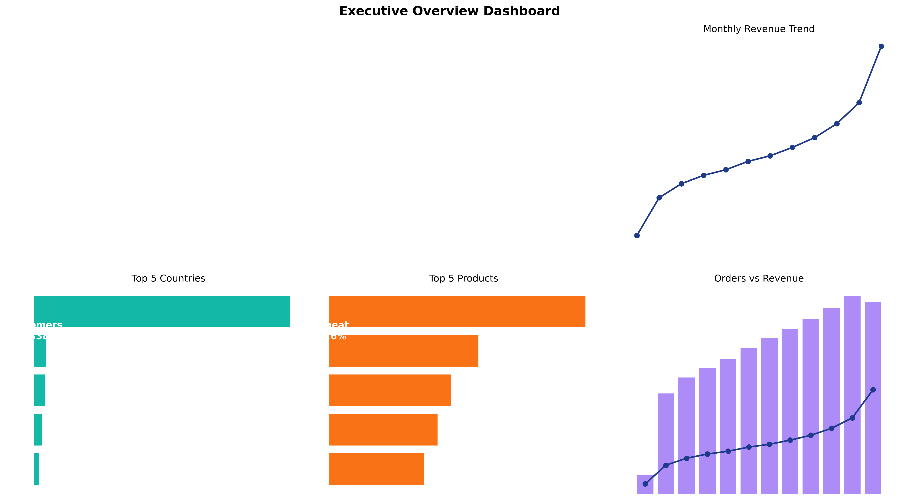
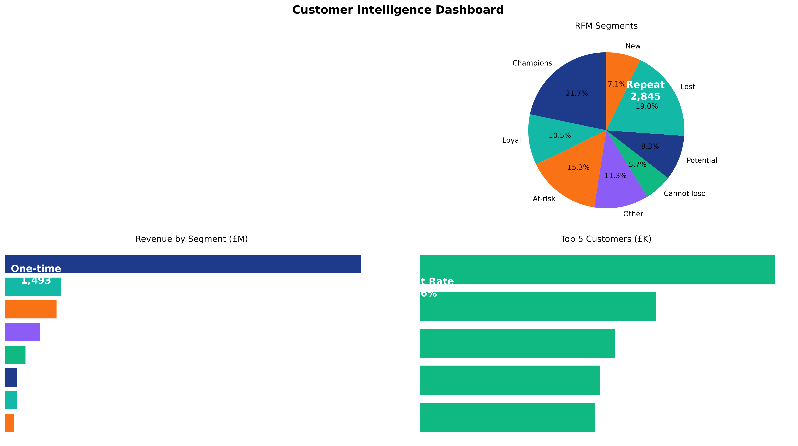

# E-Commerce Customer & Sales Analytics

A complete business analytics workflow analyzing invoice-level transactions from the UCI Online Retail dataset. This project connects technical implementation with business interpretation through reproducible Python pipelines, SQL analysis, and Power BI dashboards.

[](https://github.com/rai-ritik/ecommerce-customer-sales-analytics)
[](LICENSE)

## Table of contents

- [Project overview](#project-overview)
- [Business questions](#business-questions)
- [Dataset](#dataset)
- [Methodology](#methodology)
- [Tools](#tools)
- [Repository structure](#repository-structure)
- [Setup](#setup)
- [Project workflow](#project-workflow)
- [Completed deliverables](#completed-deliverables)
- [Dashboard](#dashboard)
- [Limitations](#limitations)
- [Reproducibility principles](#reproducibility-principles)
- [Attribution](#attribution)
- [Author](#author)

## Project overview

This project analyzes invoice-level transactions from the **Online Retail** dataset. It is designed as a complete business analytics workflow rather than a collection of isolated queries.

The project follows this pipeline:

```text
Raw transaction workbook
        ↓
Data validation and cleaning
        ↓
Exploratory sales analysis
        ↓
MySQL business queries
        ↓
RFM customer segmentation
        ↓
Power BI dashboard
        ↓
Business insights and recommendations
```

The final analysis connects technical implementation with business interpretation. Each metric has a clear definition, each transformation is documented, and important results are supported by reproducible queries or dashboard outputs.

## Business questions

The analysis addresses the following business questions:

1. **Sales performance**: What are the overall revenue, order volume, and unit sales?
2. **Time trends**: How do sales vary by month, day of week, and hour?
3. **Geographic analysis**: Which countries contribute most to revenue?
4. **Product performance**: Which products drive the most revenue?
5. **Customer behavior**: What is the distribution of repeat vs. one-time customers?
6. **Customer value**: How is revenue distributed across customer segments (RFM)?
7. **Actionable insights**: What business actions should be prioritized based on the data?

## Dataset

The project uses the [Online Retail dataset from the UCI Machine Learning Repository](https://archive.ics.uci.edu/dataset/352/online+retail). The UCI source describes the dataset as transactional data from a UK-based, non-store online retailer covering **December 1, 2010 through December 9, 2011**.

### Dataset characteristics

| Property | Description |
|---|---|
| Source | UCI Machine Learning Repository |
| Original file | `Online Retail.xlsx` |
| Local file | `data/raw/online_retail_raw.xlsx` |
| Raw rows | 541,909 |
| Clean sales rows | 524,878 |
| Time period | December 2010 to December 2011 |
| Data grain | One product line within an invoice |
| Main geography | United Kingdom and other countries |

### Source columns

| Column | Type | Description |
|--------|------|-------------|
| InvoiceNo | Text | Invoice identifier (6 characters, starts with C for cancellations) |
| StockCode | Text | Product code (5 characters) |
| Description | Text | Product name |
| Quantity | Integer | Units per product line |
| InvoiceDate | DateTime | Transaction date and time |
| UnitPrice | Decimal | Price per unit |
| CustomerID | Text | Customer identifier (7 characters, may be missing) |
| Country | Text | Customer country name |

### Derived columns

The cleaning pipeline adds the following derived columns:

| Column | Type | Description |
|--------|------|-------------|
| revenue | Decimal | `quantity × unit_price` |
| year | Integer | Calendar year |
| month | Integer | Calendar month (1–12) |
| day | Integer | Calendar day (1–31) |
| hour | Integer | Hour of day (0–23) |
| is_cancellation | Boolean | TRUE if InvoiceNo starts with "C" |
| is_return | Boolean | TRUE if negative quantity or cancellation |

## Methodology

### Data validation and cleaning

The cleaning pipeline (`python/clean_data.py`) performs:

1. **Schema validation**: Verify 8 expected columns, check data types.
2. **Duplicate removal**: Remove exact duplicate rows (5,268 found).
3. **Cancellation handling**: Flag invoices starting with "C".
4. **Return handling**: Flag negative quantities.
5. **Revenue calculation**: Compute `quantity × unit_price`.
6. **Calendar fields**: Extract year, month, day, hour from InvoiceDate.
7. **Separation**: Split clean sales from returns/cancellations.

**Cleaning results:**

| Metric | Value |
|--------|-------|
| Raw rows | 541,909 |
| Exact duplicates removed | 5,268 |
| Clean sales rows | 524,878 |
| Returns/cancellations | 11,763 |
| Missing CustomerIDs | 135,080 (25.6%) |
| Distinct invoices | 19,960 |
| Distinct products | 3,922 |
| Countries | 38 |

### Sales analysis

The analysis computes:

- **Overall KPIs**: Revenue, orders, units, customers, products, countries.
- **Monthly trends**: Revenue, orders, units by month with MoM growth.
- **Country analysis**: Revenue and share by country.
- **Product analysis**: Revenue and units by product (top 20).
- **Customer analysis**: Revenue and orders by customer (top 20).

### RFM segmentation

RFM analysis uses the following methodology:

- **Analysis date**: 2011-12-10 (one day after last transaction).
- **Recency**: Days since last completed purchase.
- **Frequency**: Number of distinct completed-sales invoices.
- **Monetary**: Total completed-sales revenue.
- **Scoring**: Quintiles (1–5) for each dimension.
- **Composite score**: `r_score + f_score + m_score`.
- **RFM code**: Three-character code (e.g., "555").
- **Segments**: Champions, Loyal customers, At-risk, Cannot lose them, etc.

**RFM results:**

| Segment | Customers | Share | Revenue | Share |
|---------|-----------|-------|---------|-------|
| Champions | 941 | 21.69% | £5,741,913.58 | 64.61% |
| Loyal customers | 457 | 10.53% | £901,405.29 | 10.14% |
| At-risk customers | 663 | 15.28% | £827,416.57 | 9.31% |
| Other customers | 490 | 11.30% | £566,361.89 | 6.37% |
| Cannot lose them | 248 | 5.72% | £334,793.25 | 3.77% |
| Potential loyalists | 405 | 9.34% | £191,145.91 | 2.15% |
| Lost or low-value | 824 | 18.99% | £188,415.28 | 2.12% |
| New customers | 310 | 7.15% | £135,757.12 | 1.53% |

## Tools

| Category | Tools |
|----------|-------|
| Programming | Python 3.10+, pandas, openpyxl |
| Database | MySQL 8.0+ |
| Spreadsheets | Microsoft Excel |
| Visualization | Power BI Desktop |
| Version control | Git, GitHub |
| Environment | Python virtualenv, macOS Terminal |

## Repository structure

ecommerce-customer-sales-analytics/
├── README.md # This file
├── LICENSE # MIT License
├── .gitignore # Git ignore rules
├── data/
│ ├── raw/
│ │ ├── .gitkeep
│ │ └── online_retail_raw.xlsx # Raw dataset (ignored)
│ └── processed/
│ ├── .gitkeep
│ ├── clean_sales.parquet # Cleaned sales (ignored)
│ └── returns_cancellations.parquet # Returns/cancellations (ignored)
├── docs/
│ ├── README.md # Data documentation
│ ├── business_insights.md # Evidence-based business findings
│ ├── excel_analysis.md # Excel analysis guide
│ ├── sales_profile.csv # Overall KPIs
│ ├── monthly_sales.csv # Monthly trends
│ ├── country_sales.csv # Country analysis
│ ├── product_sales.csv # Product analysis
│ ├── customer_sales.csv # Customer analysis
│ ├── rfm_customers.csv # RFM customer scores
│ └── rfm_segments.csv # RFM segment summary
├── python/
│ ├── clean_data.py # Data cleaning pipeline
│ ├── profile_sales.py # KPI profile
│ ├── monthly_sales.py # Monthly trends
│ ├── country_sales.py # Country analysis
│ ├── product_sales.py # Product analysis
│ ├── customer_sales.py # Customer analysis
│ ├── rfm_segmentation.py # RFM scoring
│ └── rfm_summary.py # RFM segment summary
├── sql/
│ ├── README.md # SQL documentation
│ ├── 01_create_database.sql # Create database
│ ├── 02_create_tables.sql # Create tables
│ ├── 03_import_data.sql # Import CSV data
│ ├── 04_kpi_analysis.sql # Overall KPIs
│ ├── 05_product_analysis.sql # Product analysis
│ ├── 06_country_analysis.sql # Country analysis
│ ├── 07_time_trends.sql # Time trends
│ ├── 08_customer_analysis.sql # Customer analysis
│ ├── 09_rfm_segmentation.sql # RFM segmentation
│ └── 10_validation_checks.sql # Validation queries
└── powerbi/
├── README.md # Power BI documentation
├── data_model.md # Data model and relationships
└── dax_measures.md # DAX measures reference

## Setup

### Prerequisites

- Python 3.10 or later
- Git
- MySQL 8.0+ (optional, for SQL analysis)
- Microsoft Excel (optional, for Excel analysis)
- Power BI Desktop (optional, for dashboard)

### Clone the repository

```bash
git clone https://github.com/rai-ritik/ecommerce-customer-sales-analytics.git
cd ecommerce-customer-sales-analytics
```

### Create the Python environment

```bash
python3 -m venv .venv
source .venv/bin/activate
python -m pip install --upgrade pip
python -m pip install pandas openpyxl
```

### Obtain the dataset

1. Download from [UCI Machine Learning Repository](https://archive.ics.uci.edu/dataset/352/online+retail).
2. Save as `data/raw/online_retail_raw.xlsx`.
3. The file is approximately 23 MB and is ignored by Git.

### Inspect the raw workbook

```bash
source .venv/bin/activate
python - <<'PY'
import pandas as pd

df = pd.read_excel("data/raw/online_retail_raw.xlsx", engine="openpyxl")
print("Shape:", df.shape)
print("\nColumns:", list(df.columns))
print("\nMissing values:\n", df.isna().sum())
PY
```

Expected output:
- Shape: (541909, 8)
- Columns: InvoiceNo, StockCode, Description, Quantity, InvoiceDate, UnitPrice, CustomerID, Country
- Missing values: CustomerID (~135k), Description (~1.5k)

## Project workflow

The project follows a phased, reproducible workflow:

### Phase 1: Dataset inspection and documentation ✅

- Inspect raw workbook schema and quality.
- Document data dictionary and cleaning rules.
- Create `data/README.md`.

**Commit:** `995b54c` - docs: document dataset schema and cleaning rules

### Phase 2: Reproducible cleaning pipeline ✅

- Create `python/clean_data.py`.
- Generate `clean_sales.parquet` and `returns_cancellations.parquet`.
- Record validation metrics.

**Commit:** `1b0c167` - feat: add reproducible retail data cleaning pipeline

### Phase 3: Sales analysis ✅

- Overall KPIs (`python/profile_sales.py`).
- Monthly trends (`python/monthly_sales.py`).
- Country analysis (`python/country_sales.py`).
- Product analysis (`python/product_sales.py`).
- Customer analysis (`python/customer_sales.py`).

**Commits:** `432376c`, `58f5b69`, `529ad87`, `0e24cd0`, `ed5b505`

### Phase 4: RFM segmentation ✅

- RFM scoring (`python/rfm_segmentation.py`).
- Segment summary (`python/rfm_summary.py`).

**Commits:** `82acdd1`, `930d41e`

### Phase 5: Documentation ✅

- Business insights (`docs/business_insights.md`).
- Excel analysis guide (`docs/excel_analysis.md`).
- SQL analysis pipeline (`sql/` directory).
- Power BI documentation (`powerbi/` directory).

**Commits:** `83fa411`, `e569b81`, `7530f9d`, `1223b8d`

## Completed deliverables

### Documentation

- ✅ `docs/README.md` - Data documentation and schema
- ✅ `docs/business_insights.md` - Evidence-based business findings
- ✅ `docs/excel_analysis.md` - Excel analysis guide
- ✅ `sql/README.md` - SQL analysis documentation
- ✅ `powerbi/data_model.md` - Power BI data model
- ✅ `powerbi/dax_measures.md` - DAX measures reference

### Analysis outputs

- ✅ `docs/sales_profile.csv` - Overall KPIs
- ✅ `docs/monthly_sales.csv` - Monthly trends (13 months)
- ✅ `docs/country_sales.csv` - Country analysis (38 countries)
- ✅ `docs/product_sales.csv` - Product analysis (3,922 products)
- ✅ `docs/customer_sales.csv` - Customer analysis (4,338 customers)
- ✅ `docs/rfm_customers.csv` - RFM customer scores
- ✅ `docs/rfm_segments.csv` - RFM segment summary

### SQL pipeline

- ✅ `sql/01_create_database.sql` - Create database
- ✅ `sql/02_create_tables.sql` - Create tables (clean_sales, returns_cancellations, rfm_customers)
- ✅ `sql/03_import_data.sql` - Import CSV data
- ✅ `sql/04_kpi_analysis.sql` - Overall KPIs
- ✅ `sql/05_product_analysis.sql` - Product analysis
- ✅ `sql/06_country_analysis.sql` - Country analysis
- ✅ `sql/07_time_trends.sql` - Time trends
- ✅ `sql/08_customer_analysis.sql` - Customer analysis
- ✅ `sql/09_rfm_segmentation.sql` - RFM segmentation
- ✅ `sql/10_validation_checks.sql` - Validation queries

### Key findings

- **Total revenue**: £10,642,110.80
- **Total orders**: 19,960
- **Total units sold**: 5,572,420
- **Identified customers**: 4,338 (2,845 repeat, 1,493 one-time)
- **Unique products**: 3,922
- **Countries**: 38 (UK = 84.59% of revenue)
- **Strongest month**: November 2011 (£1,503,866.78)
- **Top customer**: 14646 (£280,206.02)
- **Top product**: DOTCOM POSTAGE (£206,248.77)
- **Champions**: 21.69% of customers, 64.61% of revenue

## Dashboard

The Power BI dashboard (planned) will include two pages:

### Executive overview

- Revenue KPI card
- Orders KPI card
- Customers KPI card
- Average order value
- Monthly revenue trend (line chart)
- Revenue by country (bar chart, top 10)
- Top products (bar chart, top 20)
- Slicers: Date range, Country

### Customer intelligence

- RFM segment distribution (donut chart)
- Revenue by RFM segment (bar chart)
- Top customers (table, top 20)
- Repeat vs one-time customers (pie chart)
- Customer detail table (customer_id, orders, revenue, segment)
- Retention/cohort analysis (matrix)

## Limitations

1. **Partial December 2011**: Data ends December 9, 2011. December metrics are incomplete.
2. **Missing CustomerIDs**: 135,080 rows (25.6%) lack CustomerID, excluding them from customer and RFM analysis.
3. **Single-year snapshot**: Analysis covers only 12 months; seasonal patterns beyond this period are unknown.
4. **UK concentration**: 84.59% of revenue is from the UK; insights may not generalize to other markets.
5. **No external context**: No marketing spend, pricing changes, or competitive data to explain trends.
6. **RFM scoring date**: RFM uses 2011-12-10 as the analysis date; scores reflect that point in time only.
7. **Overlapping return conditions**: Returns/cancellations have overlapping flags; counts are not additive.

## Reproducibility principles

This project follows reproducibility principles:

- **Raw data is never modified**: The raw workbook is read-only.
- **All transformations are scripted**: Python pipelines generate all outputs.
- **Generated files are Git-ignored**: Only code and documentation are committed.
- **Validation is automated**: Each script records validation metrics.
- **Documentation is versioned**: All documentation is in Git alongside code.

To regenerate all outputs:

```bash
source .venv/bin/activate
python python/clean_data.py
python python/profile_sales.py
python python/monthly_sales.py
python python/country_sales.py
python python/product_sales.py
python python/customer_sales.py
python python/rfm_segmentation.py
python python/rfm_summary.py
```

## Attribution

- **Dataset**: UCI Machine Learning Repository, "Online Retail" ([https://archive.ics.uci.edu/dataset/352/online+retail](https://archive.ics.uci.edu/dataset/352/online+retail)).
- **License**: Dataset is publicly available for research and educational use.
- **Project**: E-Commerce Customer & Sales Analytics by Rai Ritik.

## Author

**Rai Ritik**

- GitHub: [@rai-ritik](https://github.com/rai-ritik)
- Location: Trento, Trentino-Alto Adige, Italy
- Role: Software Developer / Data Science Student

---

**Last updated:** 2026-08-18  
**Latest commit:** 1223b8d (docs: add Power BI data model and DAX measures documentation)

## 📊 Dashboard Visualizations

Interactive dashboard visualizations showcasing key business insights from the e-commerce analytics platform.

### Executive Overview Dashboard



**Key Visuals:**
- **KPI Cards:** Total Revenue (£10.6M), Total Orders (19,960), Avg Order Value (£533), Total Customers (4,338), Repeat Rate (65.58%)
- **Monthly Revenue Trend:** Growth trajectory from Dec 2010 to Dec 2011, peaking at £1.5M in November 2011
- **Top 10 Countries by Revenue:** Geographic distribution with UK leading at £9M (84.59%)
- **Top 6 Products by Revenue:** Product performance analysis, DOTCOM POSTAGE leading at £206K
- **Monthly Orders vs Revenue:** Dual-axis comparison of order volume and revenue trends

### Customer Intelligence Dashboard



**Key Visuals:**
- **Customer KPIs:** Identified Customers (4,338), Repeat Customers (2,845), Repeat Rate (65.58%), Avg Revenue per Customer (£2,453)
- **RFM Segments Distribution:** Customer segmentation across 8 behavioral clusters
- **Revenue by RFM Segment:** Champions segment drives 64.61% of revenue (£5.74M)
- **RFM Performance Matrix:** Comprehensive segment analysis with customer counts and revenue contribution
- **Top 6 Customers:** Customer 14646 leads with £280K revenue across 526 orders

### Dashboard Features

**Data Architecture:**
- Star schema data model with dimension tables (Date, Customer, Product, Country)
- Time intelligence calculations for trend analysis
- RFM segmentation algorithm for customer behavior analysis

**Key Metrics:**
- Revenue analytics: £10.6M total, £533 average order value
- Customer retention: 65.58% repeat customer rate
- Geographic insights: 38 countries, UK dominance at 84.59%
- Product performance: 3,922 unique products, top item £206K revenue

**Visual Analytics:**
- Time-series trend analysis with seasonal patterns
- Geographic revenue distribution mapping
- Customer segmentation and behavioral clustering
- Product performance ranking and comparison

### Business Insights

**Revenue Performance:**
- Consistent growth from £150K (Dec 2010) to £1.5M (Nov 2011)
- High average order value (£533) indicates B2B or bulk purchasing patterns
- Shipping services (DOTCOM POSTAGE) represent significant revenue stream

**Customer Behavior:**
- Strong customer loyalty with 65.58% repeat purchase rate
- Top 21.69% of customers (Champions) generate 64.61% of revenue
- Clear opportunity for targeted retention campaigns

**Strategic Opportunities:**
1. **VIP Program:** Retain 941 Champion customers with exclusive benefits
2. **Win-back Campaigns:** Re-engage 663 at-risk customers
3. **International Expansion:** Scale successful UK model to Germany, France, Netherlands
4. **Product Bundling:** Leverage top-performing products to increase AOV

---

**Dashboard Created:** 2026-08-18  
**Data Source:** UCI Machine Learning Repository - Online Retail Dataset  
**Analysis Period:** December 1, 2010 - December 9, 2011  
**Total Records Analyzed:** 524,878 clean sales transactions
